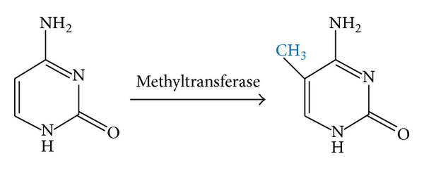
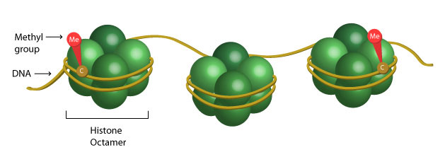
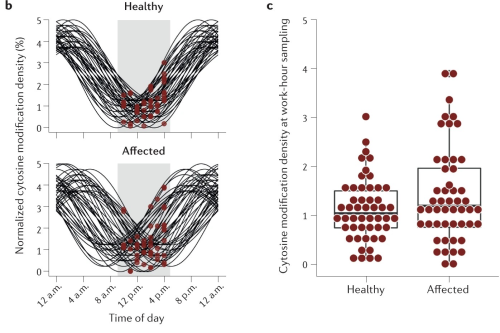

```{r setup, include=FALSE}
options(htmltools.dir.version = FALSE)
knitr::opts_chunk$set(
  fig.width=9, fig.height=3.5, fig.retina=3,
  out.width = "100%",
  cache = FALSE,
  echo = TRUE,
  message = FALSE, 
  warning = FALSE,
  hiline = TRUE
)

library(fontawesome)
library(tidyverse)
library(xaringan)
library(here)


```

```{r xaringan-themer, include=FALSE, warning=FALSE}
library(xaringanthemer)

dark_yellow <- "#EFBE43"
light_yellow <- "#FDF7E9"
gray <- "#333333"
blue <- "#4466B0"

style_duo(
  # colors
  primary_color = light_yellow,
  secondary_color = dark_yellow,
  header_color = gray,
  text_color = gray,
  code_inline_color = colorspace::lighten(gray),
  text_bold_color = colorspace::lighten(gray),
  link_color = blue,
  title_slide_text_color = blue,

  # fonts
  header_font_google = google_font("Martel", "300", "400"),
  text_font_google = google_font("Lato"),
  code_font_google = google_font("Fira Mono")  
)


```

```{r xaringanExtra, echo=FALSE, warning=FALSE}

library(xaringanExtra)
xaringanExtra::use_logo("slides/UiBlogoMED_gray_v_Eng.png",
                        width = "250px",
                        height = "250px",
                        position = xaringanExtra::css_position(top = "2em", right = "2em"))
                     

xaringanExtra::use_tile_view()

```


```{css extra.css, echo=FALSE}

.small { 
  font-size: 0.75em
}  

.bitty { 
    font-size: 1.25em;
}

.enlarge { 
    font-size: 1.5em;
}

.fade {
  opacity: 0.66;
}

```

---

background-image: url(slides/Kelly1.png)
background-position:75% 70%
background-size: 650px

class: top left
##Et Påskenøtt 
.enlarge["Astronaut Scott Kelly measured molecular changes after one year in space, <br> but not his twin on earth."]

.footnote[The NASA Twins Study: A multidimensional analysis of a year-long human spaceflight, Science, 2019]

---
class: hide_logo

background-image: url(slides/Smigielski.png)
background-position:cover
background-size: 700px

.footnote[Smigielski, _et al_, Molecular Psychiatry, 2020]

---


class: top left
### **DNA methylation** <br> <br />

.pull-left[


] 

.pull-right[


] 

---
background-image: url(slides/cellsformat.png)
background-position:50% 65%
background-size: 750px

class: top, left
### DNA derived from leukocytes

---

###General aim of this PhD work
.enlarge[
 - To identify epigenetic marks (CpGs) associated with psychosis and treatment effects. <br />
]

###Specific questions
.bitty[
- Does **time-of-blood draw** impact the association of SCZ vs. controls on cell-type proportions? <br> <br />
- What common and specific DNAm marks are seen following **antipsychotic** drug treatment for psychosis? <br> <br />

]  

---
###Project 1
 .enlarge[Does **time-of-blood draw** impact the association of SCZ vs. controls on cell-type proportions?

* Background <br><br />
  - SCZ is associated with altered cell-type proportions <br><br />
    - Factors: immune alterations (NLR), smoking, medication <br><br />
    - Disrupted diurnal (circadian) rhythms 
  ]
---
### Diurnal and Seasonal Cellular activity 

.pull-left[

image from Oh 2019
]

.pull-right[

Wyse
]

---
###Circadian rhythms and "chrono-epigenetics" <br> <br> 

.bitty[
- Methyl cycle co-evolved with circadian clocks (Fustin, _et al._, 2020) <br> <br>
- Chrono-epigenetics: <br> <br>
    - temporal dynamics of epigenetic processes <br> <br>
    - oscillating CpGs contribute to epigenetic variability (Oh, E. & Petronis, 2021)
]

---

class: top left 
### Oscillating CpGs
.center[]


---
### **Epigenetic oscillations**<br> 

.pull-left[

]

.pull-right[

.bitty[
- figure b
 - blood collection time: 09-16
 - example time: 12:00 
 - black lines: oscillation profiles
 - red dots: collection time <br> <br>
- figure c
 - CpG density at 12:00 
 ]

]

.footnote[Oh, E. & Petronis, Nature Reviews Genetics, 2021]

---

###Method of analysis 

.bitty[
1. Selected European SCZ cases & controls with recorded time-of-blood draw (n=729) <br> <br>
1. Calculated variable “hours from 07:00 baseline” <br> <br>
1. Samples matched for age and sex <br> <br>
1. Compared full day vs. half day <br> <br>
1. Sub-analyses: Neutrophil-to-lymphocyte ratio (NLR) and medication-free SCZ cases

]

---

background-image: url(slides/2021_08_05_Histogram_n729.png)
background-position: 50% 90% 
background-size: 425px

class: left, top
###Distribution of recorded blood draws (n=729)


- Model 1: Cell-type proportions ~  Case_Control + Age + Sex + Smoking_score + Methbatch + 𝜺
- Model 2: Cell-type proportions ~ Case_Control + Age + Sex + Smoking_score + Methbatch + Hours_from_baseline + 𝜺

---
background-image: url(slides/2021_09_04_Table.CorrectPvalsTeal.png)
background-position: 25% 45% 
background-size: 400px

class: top left 
###Results

.pull-right[

.enlarge[Full day (n=729)]

.bitty[
- P-values reduced significance in Model 2
- Effect sizes diminished in Model 2
]

.enlarge[Half day (n=524)]

.bitty[
- P-values: no significant change 
- Effect sizes: no change
]
]

---
class: top left hide_logo
###Results Sub-analyses 

.enlarge[
* __NLR__: significant association in all analyses (_p_ <.001) <br> <br>
* __Medication-free cases__: significant for neutrophils & CD4T adjusted/unadjusted for time-of-blood draw (_p_ <.01)

###Conclusion Project 1:

To reduce epigenetic variation associated with time-of-blood draw and the circadian cycling of white blood cells
* either correct for __cell-types__ - or for __time-of-blood draw__
]

---
###Project 2 <br> <br /> 
 .enlarge[What common and specific DNAm marks (CpGs) are seen following **antipsychotic** drug treatment for psychosis?

* Background <br><br />
  - SCZ is associated with altered cell-type proportions, e.g. NLR <br><br />
    - Factors: immune alterations, smoking, medication <br><br />
    - Disrupted circadian rhythms; both a trait and state marker (Walker II, _et al._, 2020) 
  ]


---

background-image: url(slides/clinical_course.png)
background-position: 50% 75% 
background-size: 750px

class: top left 

### Background - Psychosis
.enlarge[Symptoms:
* Hallucinations, delusions, disorganized behavior
* **Loss of insight** into their condition] 

.footnote[McCutcheon, _et al._, JAMA Psychiatry, 2020; Elanjithara, _et al._, Advances in Psych Treatment, 2011]

---
class: top left 

### Background - Antipsychotics
.enlarge[Antipsychotics (AP) first line of treatment 
* More effective for hallucinations than apathy & social withdrawl
* Long-term use associated with metabolic side effects <br> <br />
* Alterations in multiple neurotransmitter systems & genes associated with both etiology and mechanism of drug action <br> <br /> 
 - GABA/Glutamate <br> 
 - Voltage-gated Calcium channels <br> 
 - Dopamine <br> 
 - Serotonin <br> <br> 

    ]  
    
.footnote[SCZ Working Group of the PGC, medRxiv, 2022;  Kaar _et al._, Neuropharmacology, 2020]        
---
### Different classes of antipsychotics

---
background-image: url(slides/Aringhieri2.jpg)
background-position: 60% 75%
background-size: 775px

class: left, top

###Antipsychotics and corresponding receptors

.footnote[Aringhieri _et al_, Pharmacology & Therapeutics, 2018]

---

### Pharmacoepigenetic findings in for antipsychotics  

.bitty[
- Early stages still: <br> <br>
  - Study design, technology, patient population, lack of replication <br> <br>
  - No uniform identification of hyper- or hypo-methylation (i.e. _COMT_, _5-HTT_, _HTR2A_) (Burghardt, _et al._, 2020, Zhou _et al_, 2021) <br> <br>
  - DNAm associated with both the pathology and treatment (Jaffe, _et al._, 2016) <br> <br>
   - Studies of AP monotherapy are lacking (Burghardt, _et al._, 2020) <br> <br>
   - Studies of AP serum values associated with DNAm are lacking.
 
]

---
class: top left 

###**EWAS findings for antipsychotics** <br> <br />

.footnote[Burghardt _et.al_, Pharmacotherapy, 2020; Zhang & Malhotra, Current Psychiatry Reports, 2018]
.enlarge[

*  _DRD2_, _DRD3_, _HTR2A_, _SLC6A4_, _COMT_ <br> <br />
* Issue with interpretability of drug response-related DNAm for other findings <br> <br />
* Variety of methods, tissues assayed, study designs, sample sizes <br> <br />
* Lack of consistency in reporting medication <br> <br />
* Integration of genomic data & genome-wide DNAm data may be more effective     
  ]

---
background-image: url(slides/Hiemke_img3.jpg)
background-position:cover
background-size: 800px

###Factors influencing AP efficacy

.footnote[Hiemke _et al._, Pharmacopsychiatry 2018; Castberg _et al._, Acta Psychiatr Scand, 2017]

---
## Aims: 

.enlarge[Neuropsychiatric drugs have slightly different mechanisms of action. <br> <br/> We aim to identify differential DNA methylation associated with AP:

* Common effects for AP polytherapy (n = 779) 
  

* Specific effects for AP monotherapy (n = 433)
 - Aripiprazole (n = 62)
 - Olanzapine   (n = 192)
 - Quetiapine   (n = 122)  
 - Risperdal    (n = 57)

]


---

###Method of analysis <br> 

.bitty[

**To identify specific effects**: 
1. Select European SCZ, BPD and MDD cases being treated with antipsychotic monotherapy >br> <br>with positive serum values (n=433) <br> <br>
1. Model: DNAm ~ AP_serum_value + OtherMeds + Age + Sex + Smoking_score + eCells +𝜺<br> <br>
1. Identify CpGs, associated genes, and differentially methylated regions (DMRs) <br> <br>
1. Gene set enrichment analysis & Pathway analysis  <br> <br>

]

---

class:top left

### Model selected for Quetiapine  <br><br>
* .enlarge[Serum values > 0, n = 92] <br><br> <br>

.enlarge[**Mod**: DNAm ~ Serum1 + Serum2 + Serum_Lithium + Age + Sex + SmokingScore + <br> <br> Mono + Neu + NK + CD4T + CD8T + Bcells] <br> <br> <br />

---
background-image: url(slides/Que_n92_Mod1_manhatt.png)
background-position: 75% 75%
background-size: 500px


class: top left
### Preliminary results: <br> 

.enlarge[**GLT8D1: Glycosyltransferase 8 Domain Containing 1**]

.pull-left[.enlarge[CpG: Pval = 2.25e-08 <br> <br>
adj BH Pval = 0.017 ]
]

---
background-image: url(slides/Mealer_glyco.jpg)
background-position: 20% 75%
background-size: 325px

class: left top 

### Dysregulated glycosylation in SCZ 

.pull-right[.enlarge[
GluA1,***GRIA1***: glutamate; cell-surface expression <br> <br /> 
GluN2A,***GRIN2A***: glutamate; receptor localization <br> <br />
CaV1.2,***CACNA1C***: calcium;cell-surface expression <br> <br />
DR2,***DRD2***: dopamine;cell-surface expression
]
]

.pull-right[.footnote[Mealer _et al_, Molecular Psychiatry, 2020]]


---
class: top left
### Ongoing work<br> <br />

.enlarge[
* Specific effects: Continue analyses with other mono therapies<br> <br />
* Common effects: Compare antipsychotic therapy vs. non antipsychotic use
]

---

background-image: url(slides/Martens2.jpg)
background-position: 12% 60%, 20% 10%
background-size: 600px

class: top center hide_logo

# Acknowledgements

.pull-right[
**Supervisor Prof. Stéphanie Le Hellard**<br><br>
**Co-Supervisor Dr. Anne-Kristin Stavrum**<br><br>
**Colleagues in The Martens Group**<br><br>
**Dept. of Clinical Science II** <br><br><br>
**NORMENT** <br><br><br>
]

---
class: top center hide_logo

background-image: url(slides/red_egg2.png)
background-position: 50% 75%
background-size: 375px

###God Påske til alle!


