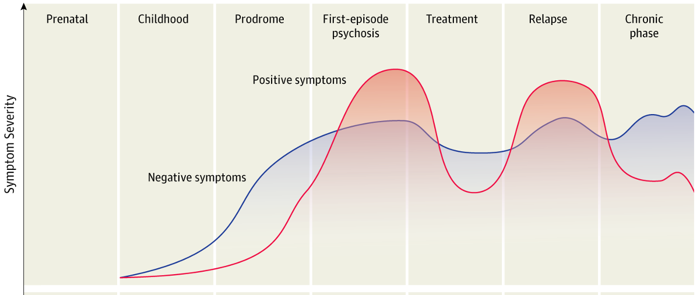
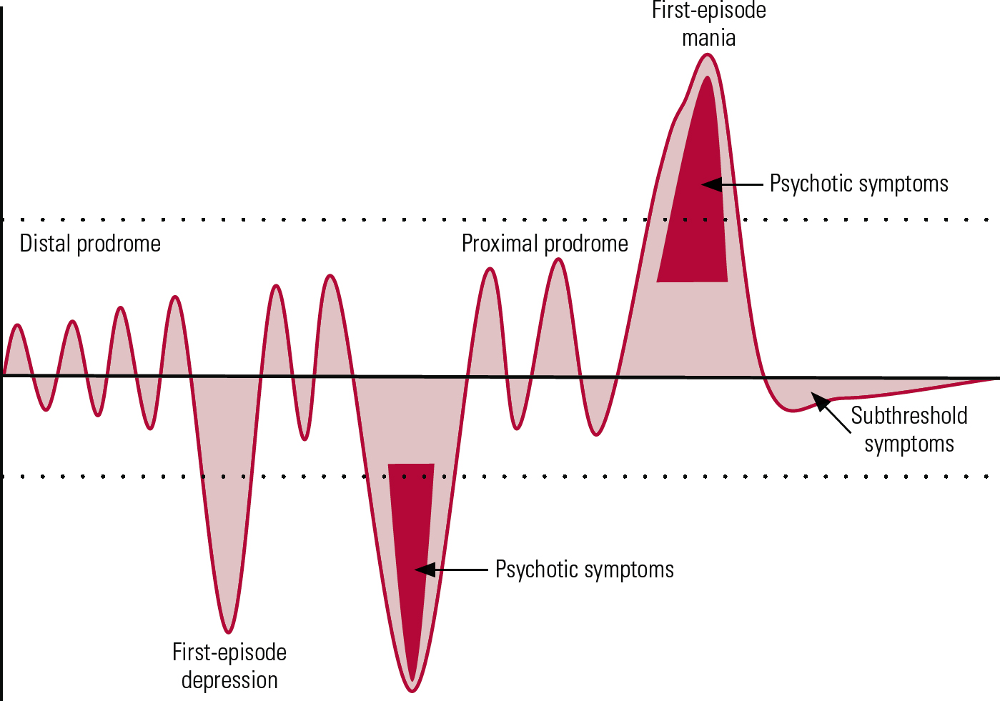

```{r setup, include=FALSE}
options(htmltools.dir.version = FALSE)
knitr::opts_chunk$set(
  fig.width=9, fig.height=3.5, fig.retina=3,
  out.width = "100%",
  cache = FALSE,
  echo = TRUE,
  message = FALSE, 
  warning = FALSE,
  hiline = TRUE
)

library(fontawesome)
library(tidyverse)
library(xaringan)
library(here)


```

```{r xaringan-themer, include=FALSE, warning=FALSE}
library(xaringanthemer)

dark_yellow <- "#EFBE43"
light_yellow <- "#FDF7E9"
gray <- "#333333"
blue <- "#4466B0"

style_duo(
  # colors
  primary_color = light_yellow,
  secondary_color = dark_yellow,
  header_color = gray,
  text_color = gray,
  code_inline_color = colorspace::lighten(gray),
  text_bold_color = colorspace::lighten(gray),
  link_color = blue,
  title_slide_text_color = blue,

  # fonts
  header_font_google = google_font("Martel", "300", "400"),
  text_font_google = google_font("Lato"),
  code_font_google = google_font("Fira Mono")  
)


```

```{r xaringanExtra, echo=FALSE, warning=FALSE}

library(xaringanExtra)
xaringanExtra::use_logo("slides/UiBlogoMED_gray_v_Eng.png",
                        width = "250px",
                        height = "250px",
                        position = xaringanExtra::css_position(top = "2em", right = "2em"))
                     

xaringanExtra::use_tile_view()

```


```{css extra.css, echo=FALSE}

.small { 
  font-size: 0.75em
}  

.bitty { 
    font-size: 1.25em;
}

.enlarge { 
    font-size: 1.5em;
}

.fade {
  opacity: 0.66;
}

```

---

background-image: url(slides/Kelly1.jpeg)
background-position:75% 70%
background-size: 650px

class: top left
##Et Påskenøtt 
.enlarge["Astronaut Scott Kelly measured molecular changes after one year in space, <br> but not his twin on earth."]

.footnote[The NASA Twins Study: A multidimensional analysis of a year-long human spaceflight, Science, 2019]


---
class: hide_logo

background-image: url(slides/Smigielski.png)
background-position:cover
background-size: 750px

.footnote[Smigielski, _et al_, Molecular Psychiatry, 2020]

---


class: top left
### **DNA methylation** <br> <br />

.pull-left[


] 

.pull-right[


] 

---
background-image: url(slides/cellsformat.png)
background-position:50% 65%
background-size: 750px

class: top, left
### DNA derived from leukocytes

---

###General aim of this PhD work
.enlarge[
 - To identify epigenetic marks (CpGs) associated with psychosis and treatment effects. <br />
]

###Specific questions
.bitty[
- Does **time-of-blood draw** impact the association of SCZ vs. controls on cell-type proportions? <br> <br />
- What common and specific DNAm marks are seen following **antipsychotic** drug treatment for psychosis? <br> <br />

]  

---
###Project 1
 .enlarge[Does **time-of-blood draw** impact the association of SCZ vs. controls on cell-type proportions?

* Background <br><br />
  - SCZ is associated with altered cell-type proportions, e.g. NLR <br><br />
    - Immune response: disorder, smoking, medication <br><br />
    - Blood collection:  morning for  patients, morning/afternoon for controls 
  
  ]
---
### **Epigenetic oscillations**<br> 

.pull-left[

]

.pull-right[

.bitty[
- figure b
 - blood collection time: 09-16
 - example time: 12:00 
 - black lines: oscillation profiles
 - red dots: collection time <br> <br>
- figure c
 - CpG density at 12:00 
 ]

]

.footnote[Oh, E. & Petronis, Nature Reviews Genetics, 2021]


---

###Circadian rhythms and "chrono-epigenetics" <br> <br> 

.bitty[
- Methyl cycle co-evolved with circadian clocks (Fustin, _et al._, 2020) <br> <br>
- Circadian rhythms are disrupted in serious mental disorders (Walker II, _et al._, 2020) <br> <br>
- Chrono-epigenetics: <br> <br>
    - temporal dynamics of epigenetic processes <br> <br>
    - oscillating CpGs contribute to epigenetic variability (Oh, E. & Petronis, 2021)
]


---
### **Epigenetic oscillations**<br>

- Dysregulated circadian rhythmicity: both a trait and state marker (Walker II, _et al._, 2020) <br> <br>
- Medication primary form of treatment

---
class: top left 
### Oscillating CpGs
.center[]

---


### The Data  (N = 2365)

.bitty[
- TOP cohort (NORMENT): recruitment and blood samples <br> <br>
- DNA sent in three batches to Bonn for typing <br> <br>
- State-of-the art **Illumina EPIC 850K** microarray <br> <br>
- First PCA showed big batch effects <br> <br>
- QC: each batch separately and then merged the three <br> <br>
- PCA: technical replicates in each batch clustered close to each other <br> <br>
]

.enlarge[This dataset is the starting point for all of the projects that will be described next.]


---
###Method of analysis 

.bitty[
Pre-step: Estimated cell-type proportions from DNAm data (Salas, _et al._, 2018) <br> <br>
]


.bitty[
1. Selected European SCZ cases & controls with recorded time-of-blood draw (n=729) <br> <br>
1. Calculated variable “hours from 07:00 baseline” <br> <br>
1. Samples matched for age and sex <br> <br>
1. Compared full day vs. half day <br> <br>
1. Sub-analyses: Neutrophil-to-lymphocyte ratio (NLR) and medication-free SCZ cases

]

---

background-image: url(slides/2021_08_05_Histogram_n729.png)
background-position: 50% 90% 
background-size: 425px

class: left, top
###Distribution of recorded blood draws (n=729)


- Model 1: Cell-type proportions ~  Case_Control + Age + Sex + Smoking_score + Methbatch + 𝜺
- Model 2: Cell-type proportions ~ Case_Control + Age + Sex + Smoking_score + Methbatch + Hours_from_baseline + 𝜺

---
background-image: url(slides/2021_09_04_Table.CorrectPvalsTeal.png)
background-position: 25% 45% 
background-size: 400px

class: top left hide_logo
###Results

.pull-right[

###Full day (n=729)

.bitty[
- P-values reduced significance in Model 2
- Effect sizes diminished in Model 2
]

###Half day (n=524)

.bitty[
- P-values: no significant change 
- Effect sizes: no change
]
]

---
class: top left hide_logo
###Results Sub-analyses 

.bitty[
- NLR: <br> <br>
    - significant association in all analyses (_p_ <.001); <br> <br>
    - modest increase in mean NLR in half-day medication-free samples; i.e. <br> <br>
      - unadjusted mean NLR (.93) vs. adjusted mean NLR  (1.14) <br> <br>
- Medication-free cases: significant for neutrophils and CD4T adjusted/unadjusted (_p_ <.01)
]

###Conclusion Project 1:
.bitty[
**In DNAm studies, correcting for cell-type proportions will reduce epigenetic variation associated with time-of-blood draw and the circadian cycling of white blood cells.** 
]

---
###Project 2
###Common and specific effects of antipsychotics associated with psychosis

---
### Background - Psychosis
.enlarge[
* Symptoms:
     - Hallucinations, delusions, altered sensory perception <br> 
     - **Loss of insight** into their condition <br> 
     - May manifest at different stages for SCZ, BPD, MDD <br> <br />
* Treatment:
     - Antipsychotics (AP) alleviate or reduce symptoms <br> 
     - Long-term use associated with distressing side effects <br> <br />
* Biomarkers:
     - Knowledge about pathophysiology & mechanisms of drug action incomplete
       
    ] 

---
## Background - Antipsychotics
.enlarge[

* Mechanism: alterations in multiple neurotransmitter systems & genes <br> <br>
 - GABA/Glutamate <br> 
 - Voltage-gated Calcium channels <br> 
 - Dopamine <br> 
 - Serotonin <br> <br> 
* Recent work suggests implications beyond synaptic biology [1,2]

    ]  
.footnote[[1] SCZ Working Group of the PGC, medRxiv, 2022;  [2] Kaar _et al._, Neuropharmacology, 2020]        


---
background-image: url(slides/Aringhieri2.jpg)
background-position: 60% 75%
background-size: 775px

class: left, top

###Antipsychotics and corresponding receptors

.footnote[Aringhieri _et al_, Pharmacology & Therapeutics, 2018]


---

### Pharmacoepigenetic findings in psychiatry 

.bitty[
- Early stages still: <br> <br>
  - Study design, technology, patient population, lack of replication <br> <br>
  - No uniform identification of hyper- or hypo-methylation (i.e. _COMT_, _5-HTT_, _HTR2A_) (Burghardt, _et al._, 2020, Zhou _et al_, 2021) <br> <br>
  - Lacking studies of AP monotherapy (Burghardt, _et al._, 2020) <br> <br>
  - DNAm associated with both the pathology and treatment (Jaffe, _et al._, 2016) <br> <br>
  - "Tissue issue" - relevance of peripheral blood (Bakulski, _et al._, 2016)
]
---
Serum values impacted by 

.enlarge[
* Age
* Sex
* Polypharmacy
* Smoking
* Diet
* Adherence 

]

.footnote[Castberg _et ak._, ]
---
class: top left
### Background: Clinical Course of SCZ and BPD

.pull-left[

]

.pull-right[

]


.pull.left[.footnote[McCutcheon, _et al.,_ JAMA Psychiatry, 2020]]
.pull-right[.footnote[Elanjithara, _et al.,_ 2011]]


---
###Methods <br> 

.bitty[
1. Select European SCZ, BPD and MDD cases being treated with antipsychotics <br> <br>
1. Select samples with blood drawn within 4 months of interview date <br> <br>
1. **Common**: Compare AP-use vs. non AP-use   <br> <br>
1. **Specific**: Contrast mono-therapy against non-target polytherapy.  <br> <br>
1. Model: DNAm ~ Psychosis_Cases + Age + Sex + Smoking_score + eCells + Technical + 𝜺<br> <br>
1. Identify CpGs (_limma_), associated genes (_Illumina annotation_), and DMRs (_Comb-p_) <br> <br>
1. GSEA and pathway analysis (GREAT) <br> <br>

]

---
background-image: url(slides/rho_table2.png)
background-position: 50% 70%
background-size: 800px


###Correlation blood-brain DNAm  <br> 

.bitty[
- Technological improvements:  450K vs. EPIC (850K)  
- Blood / live brain-tissue samples:      r = 0.86 
- CpGs identified within promoter: r = 0.92
]


.footnote[Braun _et al._, Translational Psychiatry, 2019]

---

background-image: url(slides/Martens.jpg)
background-position: 12% 60%, 20% 10%
background-size: 600px

class: top center hide_logo

# Acknowledgements

.pull-right[
**Supervisor Prof. Stéphanie Le Hellard**<br><br>
**Co-Supervisor Dr. Anne-Kristin Stavrum**<br><br>
**Colleagues in The Martens Group**<br><br>
**Dept. of Clinical Science II** <br><br><br>
**NORMENT** <br><br><br>
]
---
class: top center hide_logo

background-image: url(slides/red_egg2.png)
background-position: 50% 75%
background-size: 375px

###God Påske til alle!


